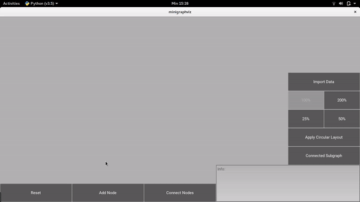

# Minigraphviz

This is a small application that can visualize graph with node(s) and normal edge(s) made using Kivy. It has feaures of:

- Add node(s)

- Connect two nodes

- Highlight nodes of a connected subgraph

- Apply circular layout for the whole graph

-----

Author: Arief Anbiya 

E-mail: anbarief@live.com

Year: 2019

Requirements:

-Python 3.5

-Kivy 1.10.0

-Numpy 1.14.1

To use the app, simply run the `minigraphviz.py`.

-----

