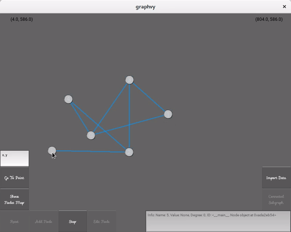
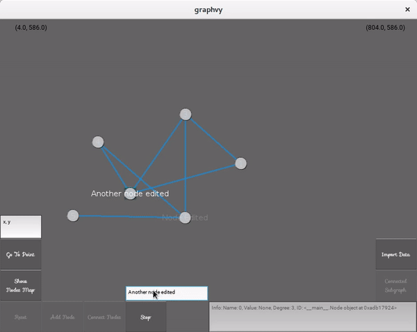

# Graphvy (test version)

Author: Arief Anbiya (anbarief@live.com), 2019

Requirements: Python 3.5, Kivy 1.10.0, Numpy 1.14.1

-----

Basic graph (data) visualization using Kivy (www.kivy.org). It has features of:

- Add node(s)

- Connect two nodes

- Highlight nodes of a connected subgraph

- Edit node's name

- Nodes map

- By default, the "Import Data" button will import a synthetic data of twitter users (real usernames but synthetic connectivity) and add it to the graph object of the app. To use different data, the filename must be `data.npy` and the format is a list of dictionaries of nodes and their neighbors ---> `[{'name': "name_of_node_1", 'neighbor': ["name_of_node_i", ....]}, ...]`

*To run the app, simply run the `graphvy.py`.*

-----

**Preview:**

